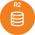

# Cloudflare Nodes for n8n

This is a collection of n8n community nodes for Cloudflare services. Currently supported services: R2 object storage, D1 serverless database, Workers AI, KV storage, and Queues.

**Disclaimer**: This is a community-developed project and is not officially affiliated with or endorsed by Cloudflare or n8n. I'm just a fan that wanted to use cloudflare services in n8n. This repository is in development, which means that not all cloudflare services are implemented as nodes yet and some operations may currently not be available. Additionally you may encounter bugs or unhelpful error messages. Please report any issues you find and provide as much context as possible, include screenshots and error messages in code blocks if possible.

## Available Nodes

###  Cloudflare R2

Object storage compatible with Amazon S3 API.

**Operations:**

- **Buckets**: List, create, delete, get info
- **Objects**: Upload, download, list, delete, copy
- **URLs**: Generate presigned URLs for temporary access

**Important Note**: R2 buckets can only be deleted when completely empty. If you encounter a 409 error when trying to delete a bucket, ensure all objects (including hidden files and incomplete multipart uploads) are removed first. You may need to manually verify the bucket is empty in the Cloudflare dashboard.

###  Cloudflare KV

Globally distributed key-value store.

**Operations:**

- **Namespaces**: List, create, delete
- **Key-Value**: Get, set, delete, list keys
- **Bulk**: Get/set/delete multiple keys at once
- **Advanced**: Expiration, metadata, prefix filtering

###  Cloudflare Queue

Message queue service for asynchronous processing.

**Operations:**

- **Queue Management**: List, create, update, delete queues
- **Messages**: Send, pull, acknowledge, retry messages
- **Trigger Mode**: Auto-poll for new messages with configurable intervals

###  Cloudflare AI

Access to Cloudflare's AI/ML models.

**Operations:**

- **Text Generation**: Completions and chat models
- **Image Generation**: AI-powered image creation
- **Speech**: Transcription and text-to-speech

###  Cloudflare D1

Serverless SQL database built on SQLite.

**Operations:**

- **Database Management**: List, create, delete databases
- **Query Execution**: Run SQL queries and commands
- **Data Operations**: CRUD operations with structured data

## Installation

Install directly in n8n:

1. Go to **Settings** > **Community Nodes**
	- ```https://your-n8n-domain.com/settings/community-nodes```
2. Enter: 
	- ```@getalecs/n8n-nodes-cloudflare```
3. Click **Install**


Or install via npm in your n8n instance:

```bash
npm install @getalecs/n8n-nodes-cloudflare
```

## Starter Templates

Get started quickly with pre-built workflow templates for each Cloudflare service. These templates demonstrate common use cases and best practices.

### Available Templates

| Template | Description | Status | Import URL |
|----------|-------------|--------|------------|
| **R2 Starter** | Basic R2 operations: upload, download, list objects | ✅ Tested | ```https://raw.githubusercontent.com/dsfaccini/cloudflare-nodes/refs/heads/master/starter-templates/r2-starter.json``` |
| **KV Starter** | Key-value operations with metadata and expiration | ✅ Tested | ```https://raw.githubusercontent.com/dsfaccini/cloudflare-nodes/refs/heads/master/starter-templates/kv-starter.json``` |
| **D1 Starter** | SQL database operations and query examples | ✅ Tested | ```https://raw.githubusercontent.com/dsfaccini/cloudflare-nodes/refs/heads/master/starter-templates/d1-starter.json``` |
| **AI Starter** | Text generation, image creation, and speech | ⚠️ Untested | ```https://raw.githubusercontent.com/dsfaccini/cloudflare-nodes/refs/heads/master/starter-templates/ai-starter.json``` |
| **Queue Starter** | Message sending and processing basics | ⚠️ Untested | ```https://raw.githubusercontent.com/dsfaccini/cloudflare-nodes/refs/heads/master/starter-templates/queue-starter.json``` |
| **Queue Trigger** | Automated message polling with error handling | ⚠️ Untested | ```https://raw.githubusercontent.com/dsfaccini/cloudflare-nodes/refs/heads/master/starter-templates/queue-trigger-starter.json``` |

### How to Import Templates

1. Copy the template URL from the table above
2. In n8n, go to **Workflows** → **Add workflow** → **Import from URL...**
3. Paste the URL and click **Import**


> 💡 **Tip**: After importing, remember to add your Cloudflare credentials in the node settings!

## Prerequisites

> [!IMPORTANT]
> **Cloudflare Queues requires a paid Workers plan**. Free accounts will receive 403 errors when using Queue nodes. [Learn more about Workers pricing](https://developers.cloudflare.com/workers/platform/pricing/).

- Valid Cloudflare account
- For Queues: Paid Workers plan
- For R2: Separate R2 API token (see below)

## Authentication

### 🔑 API Token Types

Cloudflare offers two types of API tokens with different scopes:

#### 1. **User-Level Tokens** (Recommended for most services)
Perfect for D1, AI, KV, and Queues. Use this pre-configured link:

**[📝 Create user-level token for non R2 services](https://dash.cloudflare.com/profile/api-tokens?permissionGroupKeys=%5B%7B%22key%22%3A%22ai%22%2C%22type%22%3A%22read%22%7D%2C%7B%22key%22%3A%22ai%22%2C%22type%22%3A%22edit%22%7D%2C%7B%22key%22%3A%22d1%22%2C%22type%22%3A%22read%22%7D%2C%7B%22key%22%3A%22d1%22%2C%22type%22%3A%22edit%22%7D%2C%7B%22key%22%3A%22queues%22%2C%22type%22%3A%22read%22%7D%2C%7B%22key%22%3A%22queues%22%2C%22type%22%3A%22edit%22%7D%2C%7B%22key%22%3A%22workers_kv_storage%22%2C%22type%22%3A%22read%22%7D%2C%7B%22key%22%3A%22workers_kv_storage%22%2C%22type%22%3A%22edit%22%7D%5D&name=custom-n8n-cloudflare-nodes&accountId=%2A&zoneId=all)** *(Pre-configured with required permissions)*

**[Create a separate user-level token for R2 (Recommended)](https://dash.cloudflare.com/?to=/:account/r2/api-tokens/create&type=user)**

#### 2. **Account-Level Tokens** 
**[📝 Or create an account-level token for non R2 services](https://dash.cloudflare.com/?to=/:account/api-tokens&permissionGroupKeys=%5B%7B%22key%22%3A%22ai%22%2C%22type%22%3A%22read%22%7D%2C%7B%22key%22%3A%22ai%22%2C%22type%22%3A%22edit%22%7D%2C%7B%22key%22%3A%22d1%22%2C%22type%22%3A%22read%22%7D%2C%7B%22key%22%3A%22d1%22%2C%22type%22%3A%22edit%22%7D%2C%7B%22key%22%3A%22queues%22%2C%22type%22%3A%22read%22%7D%2C%7B%22key%22%3A%22queues%22%2C%22type%22%3A%22edit%22%7D%2C%7B%22key%22%3A%22workers_kv_storage%22%2C%22type%22%3A%22read%22%7D%2C%7B%22key%22%3A%22workers_kv_storage%22%2C%22type%22%3A%22edit%22%7D%5D&name=custom-n8n-cloudflare-nodes&accountId=%2A&zoneId=all)** *(Pre-configured with required permissions)*

**[Or a separate account-level token for R2](https://dash.cloudflare.com/?to=/:account/r2/api-tokens/create&type=account)**

### 🔐 Authentication Modes

**Standard Mode** (D1, AI, KV, Queue):
- ✅ API Token (from link above)
- ✅ Account ID

**R2 Mode** (Object Storage):
- ✅ Account ID  
- ✅ R2 Access Key ID
- ✅ R2 Secret Access Key
- ✅ R2 Jurisdiction (default/eu/fedramp)

> [!WARNING]
> **R2 requires special S3-compatible API tokens**, not regular Cloudflare API tokens. These provide Access Key ID and Secret Access Key for S3 compatibility.

### 🚀 Quick Setup

1. **For most services (D1, AI, KV, Queues):**
   - Create a user or acccount api token with the permissions for the services you want to use. Use the link [above](#-quick-setup) to navigate to cloudflare dashboard to generate the api token with the required permissions pre-selected.
   - Click "Continue to summary" → "Create Token"
   - Copy the token and your Account ID

2. **For R2 object storage:**
   - Follow the [R2 API Token Guide](https://developers.cloudflare.com/r2/api/tokens/)
   - Create an S3-compatible token
   - Use the Access Key ID and Secret Access Key provided

3. **In n8n:**
   - Add Cloudflare API credentials
   - Choose the appropriate authentication mode
   - Enter your token(s) and Account ID

### 🛠️ Custom Token Generation

Need different permissions? Use the [Cloudflare API Token URL Generator](https://cfdata.lol/tools/api-token-url-generator/) to create custom pre-configured URLs.

## Key Features

- ✅ **Complete API Coverage**: Implements all major operations for each service
- ✅ **Error Handling**: Comprehensive error messages and continue-on-fail support
- ✅ **Security**: Implements a custom AWS Signature v4 for R2 authentication, and uses the official AWS SDK for generating presigned URLs.
- ✅ **Performance**: Efficient bulk operations and streaming support
- ✅ **Trigger Support**: Queue trigger node for real-time message processing

## Documentation

A detailed guide for advanced R2 usage is available in the repository:

- [Cloudflare R2 Advanced Guide](./R2 guide.md) - In-depth look at architecture, authentication, and operations.

## Examples

### Upload File to R2

```text
HTTP Request → CloudflareR2 (Upload) → Success Response
```

### Process Queue Messages

```text
CloudflareQueue Trigger → Code Node → CloudflareQueue (Acknowledge)
```

### Store Data in KV

```text
Code Node → CloudflareKV (Set) → Email Node
```

## Requirements

- n8n version 0.198.0 or higher
- Node.js 20.15.0 or higher
- Valid Cloudflare account with API access

## Troubleshooting

### 🚨 Common Issues

#### Queue Operations Return 403 Forbidden
```
Error: Request failed with status code 403
```
**Solution:** Cloudflare Queues requires a paid Workers plan. [Upgrade your account](https://dash.cloudflare.com/YOUR_ACCOUNT_ID/workers/plans) or visit your [Queue dashboard](https://dash.cloudflare.com/YOUR_ACCOUNT_ID/workers/queues).

#### R2 Authentication Errors
```
Error: The AWS Access Key Id you provided does not exist in our records
```
**Solution:** R2 requires S3-compatible API tokens, not regular Cloudflare tokens. Create one at the [R2 Token page](https://developers.cloudflare.com/r2/api/tokens/).

#### Invalid Account ID
```
Error: Unknown account identifier
```
**Solution:** Double-check your Account ID in the Cloudflare dashboard sidebar. It should be a 32-character hexadecimal string.

#### Token Permission Errors
```
Error: API token does not have the required permissions
```
**Solution:** Verify that the token you're using has the right permissions for the service you want to use it for. You can use the preconfigured links provided [above](#-quick-setup).

### 📖 Additional Resources

- [Cloudflare API Documentation](https://developers.cloudflare.com/api/)
- [Workers Pricing](https://developers.cloudflare.com/workers/platform/pricing/)
- [R2 API Tokens Guide](https://developers.cloudflare.com/r2/api/tokens/)
- [D1 Database Limits](https://developers.cloudflare.com/d1/platform/limits/)

## Support

- [GitHub Issues](https://github.com/dsfaccini/n8n-nodes-cloudflare/issues)
- [n8n Community Forum](https://community.n8n.io/)

## License

n8n original + MIT License - see [LICENSE](LICENSE) file for details.

---

Built with ❤️ for the cloudflare and n8n communities
